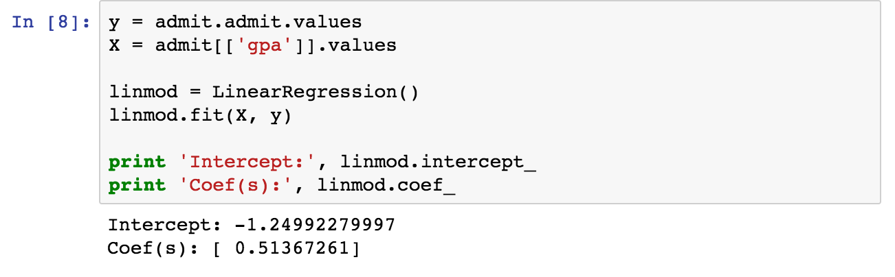
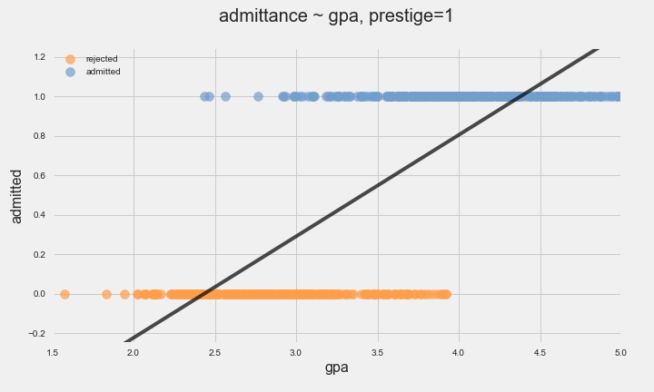
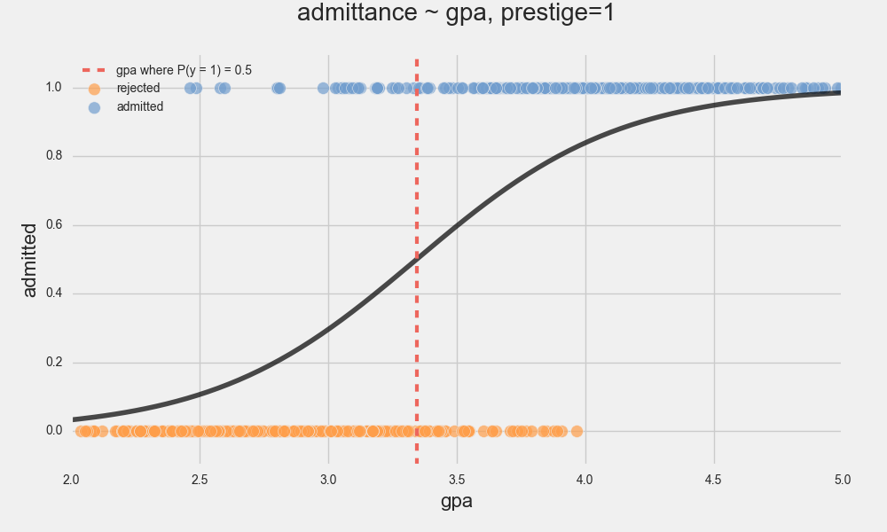
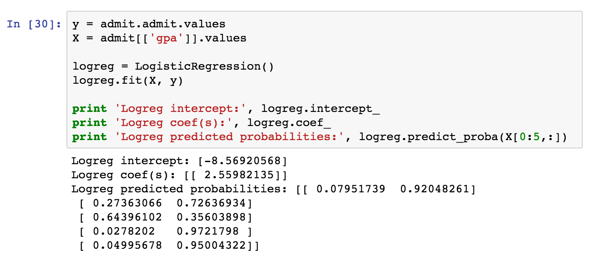

slidenumbers: true
footer:  J. Pounders, DSI-EAST-1

#   Introduction to Logistic Regression

### Justin Pounders

---
# Introduction to Logistic Regression

*Logistic regression* is a **classifier** that uses *regression* “under the hood.”

For now we will only consider the problem of *binary classification.*

---

# Example Use Cases

- Predict whether or not a user will purchase a product given their demographic characteristics.
- Predict the likelihood of a student being admitted to a college, given their scores and the characteristics of the college.
- Diagnose a patient with a disease or not, given symptoms.
- Predict whether a person will default on a loan and with what likelihood.

---

# Example

Let's predict college admittance based on GPA.

- GPA: continuous variable
- Admittance: binary (1 = yes, 0 = no)

---

# First Pass

Let's *try* to use regression...

$$
p(X) = \beta_0 + \beta_1 X
$$

where $$X=\text{GPA}$$ and $$p(X) = P(y=1 \text{ (admit)}|X)$$.

*Take a moment* to interpret this equation...

---

# First Pass

---

---

# What's the problem?

---

# What's the problem?

    

$$
p(X) = \beta_0 + \beta_1 X
$$

---

# Brief Detour: Odds Ratio

$$
\text{odds ratio}(p) = \frac{p}{1-p}
$$

For example,

- $$p = 0.5 \implies \text{odds ratio} = 1$$
- $$p = 0.75 \implies \text{odds ratio} = 3$$
- $$p = 0.4 \implies \text{odds ratio} = 2/3$$

---

# Back to College

Rather than fit regression to *probability*, let's fit regression to *log-odds*:

$$
\ln{\frac{p(X)}{1-p(X)}} = \beta_0 + \beta_1 X
$$

---

# Back to College

Rather than fit regression to *probability*, let's fit regression to *log-odds*:

$$
\ln{\frac{p(X)}{1-p(X)}} = \beta_0 + \beta_1 X
$$

**Logistic regression is linear regression applied to the log of the odds ratio.  We use this to predict probability of "classification."**

*Why "log" odds?*

^ 
p<0.5, odds < 1, log-odd < 0
p=0.5, odds = 1, log-odd = 0
p>0.5, odds > 1, log-odd > 0

---

# Logistic Regression: Final Form

$$
\ln{\frac{p(X)}{1-p(X)}} = \beta_0 + \beta_1 X
$$

---

# Logistic Regression: Final Form

$$
\ln{\frac{p(X)}{1-p(X)}} = \beta_0 + \beta_1 X
$$

$$
\frac{p(X)}{1-p(X)} = e^{\beta_0 + \beta_1 X}
$$

---

# Logistic Regression: Final Form

$$
\ln{\frac{p(X)}{1-p(X)}} = \beta_0 + \beta_1 X
$$

$$
\frac{p(X)}{1-p(X)} = e^{\beta_0 + \beta_1 X}
$$

$$
p(X) = \frac{e^{\beta_0 + \beta_1 X}}{1+e^{\beta_0 + \beta_1 X}}
$$

---

# What do we do with this?
### Making predictions with logistic regression:

$$
p(X) = \frac{e^{\beta_0 + \beta_1 X}}{1+e^{\beta_0 + \beta_1 X}}
$$

- If $$p(X) > 0.5$$ predict class 1 (admitted)
- Otherwise predict class 0 (not admitted)

---

---

# Decision Boundary

*Decision boundary* is the value of $$X$$ that produces $$p(X)=0.5$$.  This delimits the two classes we are predicting.

$$
p(X) = 0.5 = \frac{e^{\beta_0 + \beta_1 X}}{1+e^{\beta_0 + \beta_1 X}}
$$

$$
\implies 0 = \beta_0 + \beta_1 X
$$

$$
\implies X = -\frac{\beta_0}{\beta_1}
$$

---

# Pause and Reflect

Review:
*What is the input and output of logistic regression?*

Review these definitions:
1. *Odds ratio*
2. *Decision boundary*

---

# Pause and Reflect

- Logistic regression
  - **Input**: continuous variable
  - **Output**: classification
- Odds ratio: (probability "true")/(probability "false")
- Decision boundary: value of input $$X$$ *below* which logistic regression will predict class 0 and *above* which will predict class 1

---

# How do I do it?

- No closed-form linear algebra formula like in linear regression
- Must perform numerical optimization
- Can use `sklearn`

---

# How do I do it?

---

# Interpreting the Coefficients

$$
p(X) = \frac{e^{\beta_0 + \beta_1 X}}{1+e^{\beta_0 + \beta_1 X}}
$$

- What if $$\beta_1 \approx 0$$?
- How can we interpret $$\beta_0$$?

---

# Interpreting the Coefficients

$$
p(X) = \frac{e^{\beta_0 + \beta_1 X}}{1+e^{\beta_0 + \beta_1 X}}
$$

- What if $$\beta_1 \approx 0$$? *$$X$$ does not have much affect on classification!*
- How can we interpret $$\beta_0$$? *$$\beta_0$$ is the log-odds of class 1 when $$X=0$$.  This is only useful if you have centered your data!*

---

# Take-Aways and Summary

- *Logistic regression* is a model for **classification**
- It is *fast*, *efficient* and *commonly used*
- Model coefficients are interpretable (although it may require some thought!)

---

# More Information

- [`sklearn` docs](http://scikit-learn.org/stable/modules/generated/sklearn.linear_model.LogisticRegression.html)

- [`statsmodels Logit`](http://www.statsmodels.org/devel/discretemod.html) (Also see [this](http://blog.yhat.com/posts/logistic-regression-python-rodeo.html) really good blog post, http://blog.yhat.com/posts/logistic-regression-python-rodeo.html)

